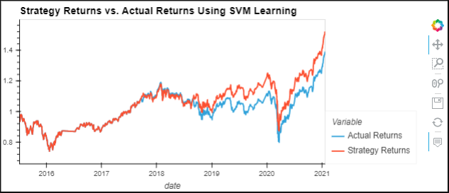
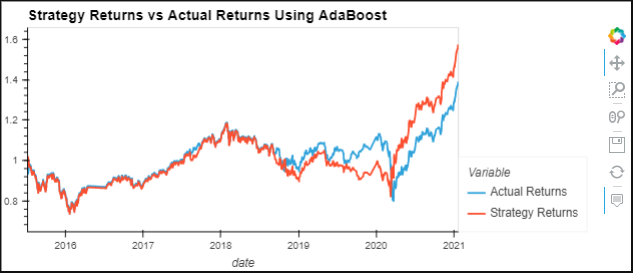

# Machine-Learning-Trading-Bot-Challenge

<b> For the inpyb file with completed code please visit machine_learing_trading_bot.ipynb </b>

## Comparing Models

The AdaBoost model has been more volatile than the SVM model but both models performed approximately the same at in terms of returns in the end. The returns were slightly higher with the tuned model of AdaBoost than the SVM leaning toward 1.6
